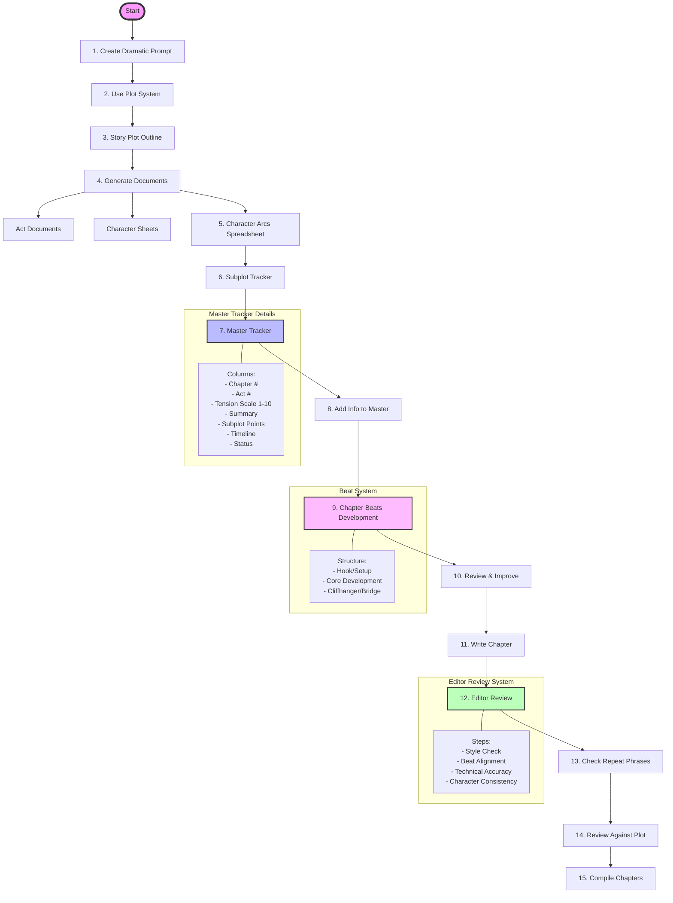

# Enhanced Book Builder Workflow

## Workflow Diagram

## Key Components

### 1. Initial Setup (Steps 1-3)
- Create dramatic premise
- Implement plot system
- Develop story outline

### 2. Documentation (Steps 4-6)
- Generate act documents
- Create character sheets
- Develop character arcs

### 3. Tracking Systems (Steps 7-8)
- Master tracker setup
- Information integration

### 4. Beat System (Step 9)
- Chapter beat development
- Three-part structure implementation

### 5. Writing & Review (Steps 10-12)
- Chapter development
- Editor review integration
- Quality checks

### 6. Quality Control (Steps 13-15)
- Phrase repetition check
- Plot alignment review
- Chapter compilation

## Usage Notes
1. Follow steps sequentially
2. Use integrated editor system throughout
3. Maintain consistent documentation
4. Update tracking systems regularly